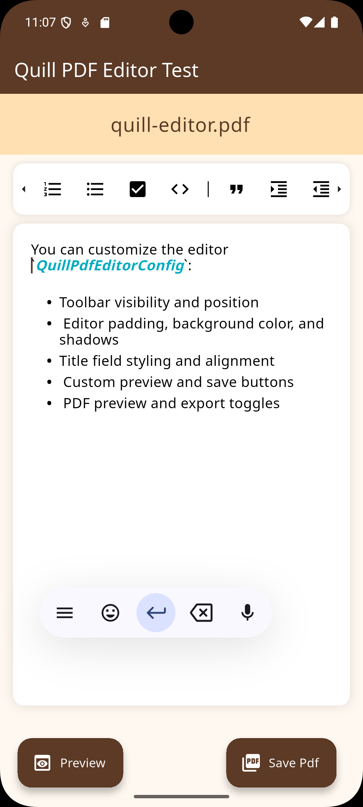
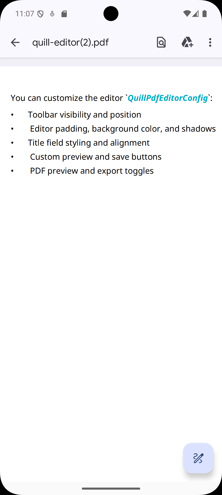

# quill_pdf_editor

<p align="center">
  
</p>

<p align="center">
  <strong>Editor Execution Preview</strong><br/>
  This image shows the live execution of the editor provided by the library.
</p>

<br/>

<p align="center">
  
</p>

<p align="center">
  <strong>PDF Export Preview</strong><br/>
  This image shows the generated PDF file after exporting the editor content.
</p>

A Flutter package that provides a rich text editor based on **flutter_quill** with built-in **PDF export and preview** support.  
The package is designed as a reusable editor widget where PDF generation, saving, and preview logic are fully handled internally by the package.

---

## Features

- Rich text editor powered by `flutter_quill`
- Vertical toolbar (top or bottom)
- Optional title field with full styling control
- Export Quill content directly to PDF
- Preview PDF before saving
- Automatic file naming
- Fully configurable UI (toolbar, editor, buttons)
- Designed as a clean, reusable package

---

## Getting Started

Add the dependency to your `pubspec.yaml`:

```yaml
dependencies:
  quill_pdf_editor: ^1.0.0
```

Then run:

```bash
flutter pub get
```

---

## Usage

```dart
import 'package:flutter/material.dart';
import 'package:quill_pdf_editor/quill_pdf_editor.dart';

class MyEditorPage extends StatelessWidget {
  const MyEditorPage({super.key});

  @override
  Widget build(BuildContext context) {
    return Scaffold(
      appBar: AppBar(title: const Text('Quill PDF Editor')),
      body: QuillPdfEditor(
        config: QuillPdfEditorConfig(
          enablePdfExport: true,
          enablePdfPreview: true,
          showToolbar: true,
          showTitleField: true,
        ),
      ),
    );
  }
}
```

The package internally manages PDF generation, file saving, preview handling, and loading state. No additional logic is required from the user.

---

## Configuration

You can customize the editor using `QuillPdfEditorConfig`:

- Toolbar visibility and position
- Editor padding, background color, and shadows
- Title field styling and alignment
- Custom preview and save buttons
- PDF preview and export toggles

---

## Example

A complete working example is available in the `/example` directory.

---

## Additional Information

- Repository:
  [https://github.com/hiam146/quill_pdf_editor](https://github.com/hiam146/quill_pdf_editor)

- Issue tracker:
  [https://github.com/hiam146/quill_pdf_editor/issues](https://github.com/hiam146/quill_pdf_editor/issues)

- Contributions are welcome via pull requests.

- Please report bugs or feature requests through GitHub issues.

---
